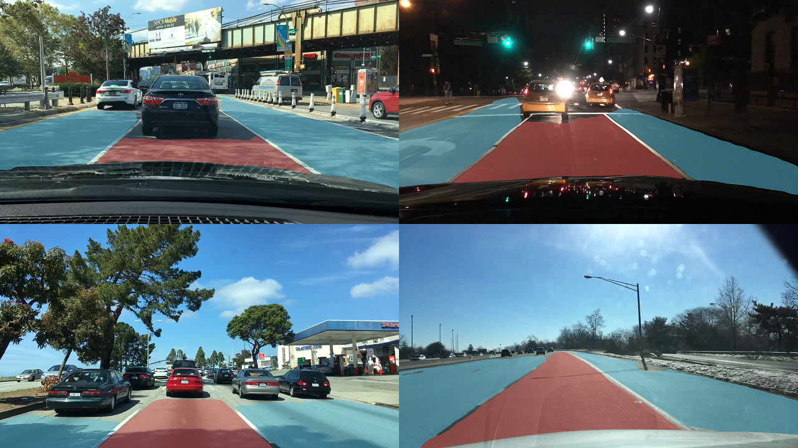

# Deeplabv3+ BDD100k/drivable_area implementation



### Introduction

This repository is merged with https://github.com/jfzhang95/pytorch-deeplab-xception and https://github.com/tamakoji/pytorch-syncbn, and is success of https://github.com/sunggukcha/deeplabv3plus-bdd100k-drivablearea. Please follow installation policies of the repositories above. 

For BDD100k/drivable_area semantic segmentation, I added 

1. bdd100k drivable area dataloader, and training/val/test scripts.
2. prediction visualization for both color (visual result) and id (greyscale png file for submission).
3. added Group Noramlization.
4. added syncBN which is implemented by tamakoji@gmailc.om
5. deeplabv3 which is without deeplabv3+ decoder, but with aspp only. 
6. WRN as backbone is added (original code from mapillary@github)
7. additional visualization that marks corrects, missed and wrong pixels.
8. IBN-Net by github.com/XingangPan/IBN-Net/

For more detail, please visit the repositories above.

### Requirements
Using python 0.4.1
```Shell
pip install -r requirements.txt
```

### Install and build
In order to use syncBN, command following line somewhere,
```Shell
git clone https://github.com/tamakoji/pytorch-syncbn
```
then in your 'deeplabs' directory,
```Shell
ln -s /path/to/tamakoji/pytorch-syncbn/modules ./
```
Do not forget to build tamakoji's syncbn. For more details, please check up his repository.


### How to train
```Shell
bash go_train.sh
```
If you want to specify cropsize, please check the code 'dataloaders/datasets/bdd100k.py'. Default is non-cropping input.


### How to evaluate
```Shell
bash go_eval.sh
```

### How to inference
For visual result,
```Shell
bash go_inference.sh
```
The code results out only 100 example, but you can easily change the code. 

For submission, 
```Shell
bash go_submit.sh
```

### Experiment & result
  
 <span style="color:red">**Single 12GB GPU**</span>

| Backbone  | Normalization  |mIoU in test |
| :-------- | :------------: |:-----------:|
| ResNet50  | Group-16       | 85.00%      |
| ResNet101 | IGN-a-16       | 85.12%      |
| ResNet101 | Group-16       | 85.33%      |
| ResNet152 | Group-16       | 85.45%      |

IGN-a-16 denotes instance group normalization with channel-grouping number 16, replacing BN of IBNNet-a with GN16.
Group-16 denotes group normalization with channel-grouping number 16.

| WAD2018   | Score          | Difference   |
| :-------- | :------------: |:-----------: | 
| 1st       | 86.18          | -0.09 |
| Mine      | 86.09          | +0.0  |
| 2nd       | 86.04          | +0.05 |
| 3rd       | 84.01          | +2.08 |

